## Projeto de Interface Interativa com Streamlit e LangChain 

Descrição:

Este projeto foi desenvolvido para criar uma aplicação interativa utilizando várias bibliotecas e módulos em Python. O objetivo principal é fornecer uma interface de usuário intuitiva e funcional que permita a interação com diferentes tipos de arquivos e modelos de linguagem.

  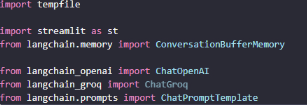

Este projeto utiliza várias bibliotecas e módulos em Python para criar uma aplicação interativa. Abaixo está uma breve descrição dos componentes principais:

tempfile: Utilizado para criar arquivos temporários.

streamlit (st): Usado para construir interfaces de usuário interativas.

langchain: Inclui vários componentes como ConversationBufferMemory, OpenAI, ChatOpenAI, e ChatPromptTemplate, que são utilizados para construir e gerenciar modelos de linguagem e prompts de conversação.
## Descrevendo as funções

### Função Carrega Arquivos:
 
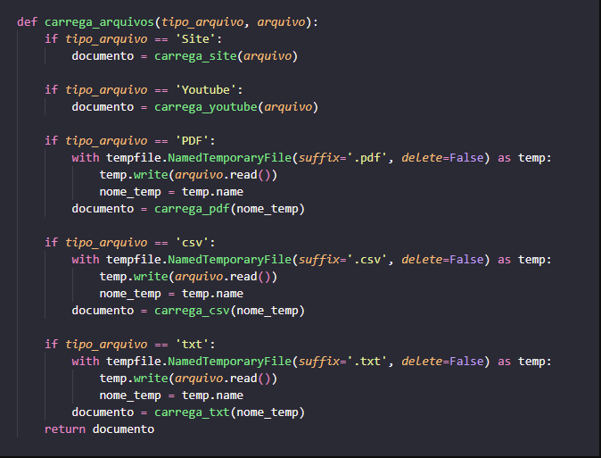

Este trecho de código define uma função carrega_arquivos que carrega arquivos de diferentes tipos (site, YouTube, PDF, CSV, TXT) e os processa de acordo com o tipo especificado. A função utiliza a biblioteca tempfile para criar arquivos temporários quando necessário. Dependendo do tipo de arquivo, ele chama funções específicas como carrega_site, carrega_youtube, carrega_pdf, e carrega_txt para processar o conteúdo.

### Função Carrega Modelo

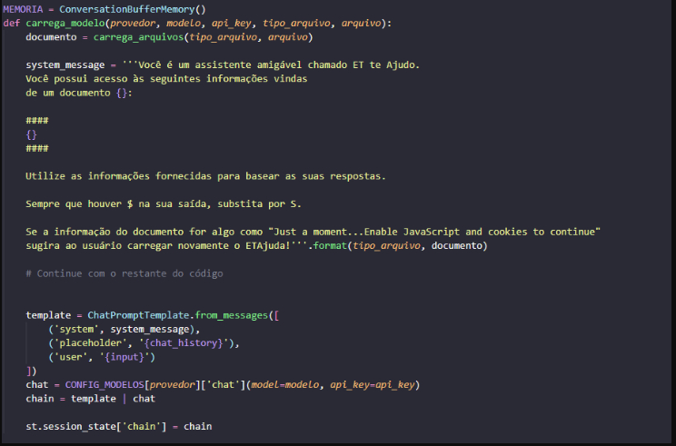

Este trecho de código inicializa a memória de conversação e carrega um modelo de chat com base no tipo de arquivo e outras opções fornecidas. Ele define uma mensagem do sistema que orienta o assistente a usar informações do documento para responder às perguntas do usuário. O código também cria um template de prompt de chat e configura o estado da sessão com a cadeia de processamento.

###  Função Página do Chat

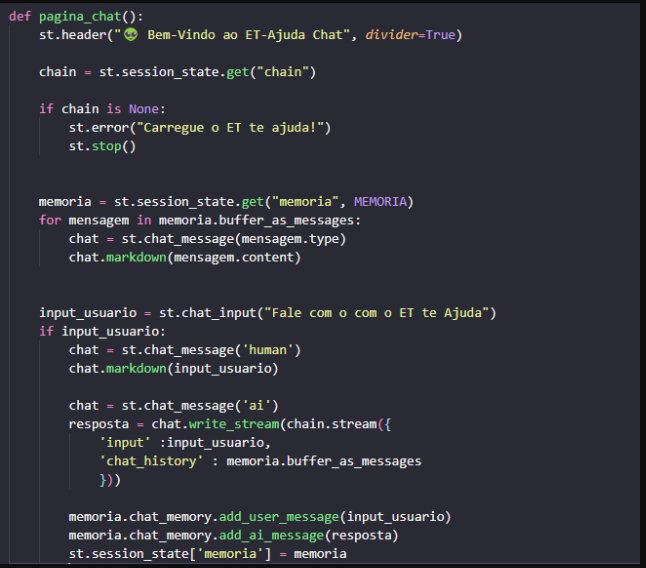

Este trecho de código define a função pagina_chat() que configura a interface de chat usando a biblioteca Streamlit. A função exibe um cabeçalho de boas-vindas, verifica se a cadeia de processamento (chain) está carregada, e exibe mensagens anteriores da memória de conversação. Ela também lida com a entrada do usuário e gera respostas usando o modelo de chat, atualizando a memória de conversação com as mensagens do usuário e do assistente.

### Função da SideBar

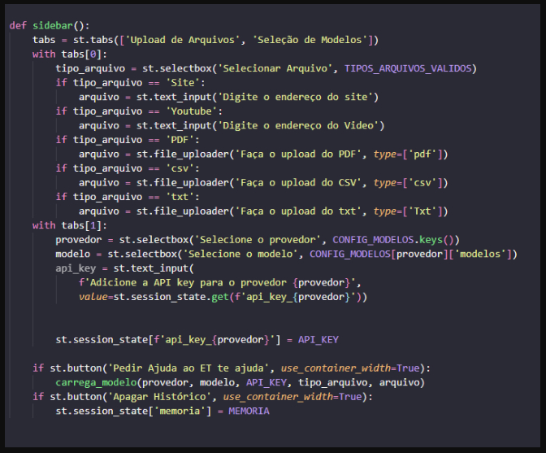

Este trecho de código define a função sidebar() que configura a barra lateral da interface usando a biblioteca Streamlit. A função cria abas para upload de arquivos e seleção de modelos. Dependendo do tipo de arquivo selecionado, ela permite ao usuário fazer upload de arquivos ou inserir URLs. Também permite a seleção de modelos e a inserção de chaves de API. A função inclui botões para gerar respostas e apagar o histórico de conversação.

## Instalação do Projeto

### Abra o terminal (ou prompt de comando).

#### Navegue até o diretório do seu projeto:

cd /caminho/para/seu/projeto

Crie o ambiente virtual:

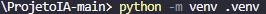

python -m venv nome_do_ambiente

Substitua nome_do_ambiente pelo nome que você deseja dar ao seu ambiente virtual.

Ative o ambiente virtual:

No Windows:

nome_do_ambiente\Scripts\activate

No macOS/Linux:

source nome_do_ambiente/bin/activate

Instale as dependências necessárias (se houver um arquivo requirements.txt):

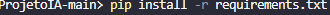

pip install -r requirements.txt

Se der o seguinte erro, rode o update "python.exe -m pip install --upgrade pip"

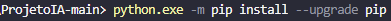

Desative o ambiente virtual quando terminar:

deactivate

### Rodando o App na web

### Primeiro terá que rodar o seguinte comando:

Esse comando irá abrir uma página Web.

## Funções do ETAjuda

### Como usar para ler um site 

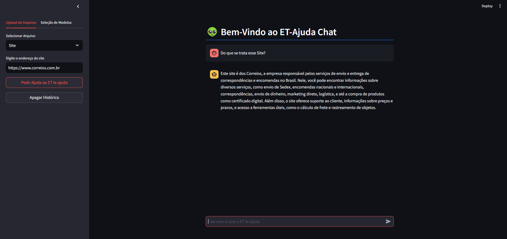

Vc irá selecionar um link do Site que dejesa analisar, logo após é só fazer perguntas sobre o site que o ETAjuda irá te fornecer.

### Como usar para ler um CSV

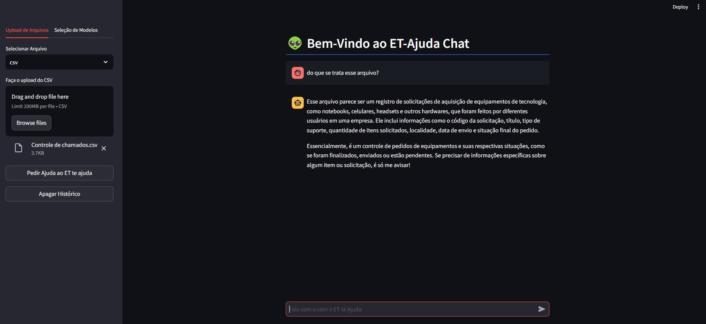

Aqui vc irá selecionar um arquivo CSV, logo após é só fazer as perguntas das informações que gostaria extrair do documento. No exemplo acima foi usado um CSV de controle de chamados IT.

### Como usar para ler um Txt

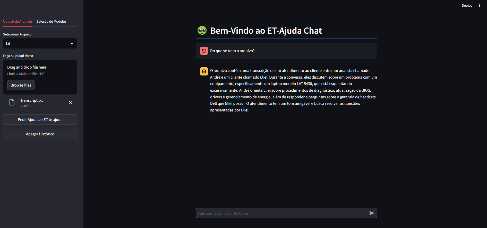

Mesmo processo que o CSV, irá selecionar um arquivo Txt e ele te informará as informações nele contido, de acordo com oque for pedido. No video acima ele fornece um trancrisação de uma resolução de  um chamado IT. 

### Como usar para ler um PDF

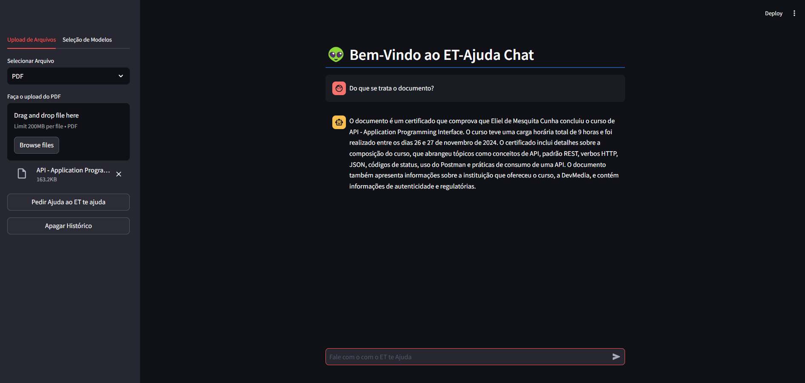

O processo é o mesmo, selecionar o PDF e extrair informações de acordo com a sua necessidade.
